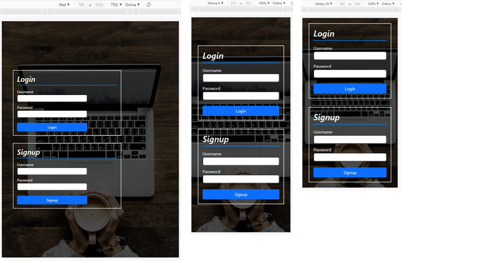

### Demo video

https://user-images.githubusercontent.com/75696222/109701910-3dfc6d80-7b9c-11eb-9720-0f543b61691e.mp4

### Basics
In this repo I built a basic login/signup system that can be integrated to any website such as eshop, blog, social media etc.
The system is hosted at my laptop which is set as a local server, using WAMP software. Also I used phpMyAdmin to interract with MySQL, which is my RDBMS.  
For this project I created a database called "mydatabase" which contains a table called "users" with all the id's, names and the passwords of the enrolled users.

Tools: html, CSS, PHP, MySQL, phpMyAdmin, WAMP local server.

### Login 
1.	The user enters username and password at index.php form - both required.
2.	An SQL query is executed to check if **both** of these credentials exist in my database’s table.
  - If yes, it means that the user has already signed up and is redirected to another page (SuccessLogin.php) that shows a message, something like “Welcome username…”.

  -	If not, then the user is redirected to the index.php and at the url is encorporated the message “UserNOTFound”.

*The code that executes the query and checks if username and password exists at the table, is in file: “includes/validation.php”.

### Signup
1.	The user enters username and password at index.php form- both required.
2.	Check if the username already exists in the table.
  -	If yes, it means that this username is already taken the user must type a new one. In that case the user is redirected to the index.php and at the url is encorporated the message “This_user_already_exists”.

  - If not, then the username is available, the insert query is executed and the user is redirected to a new page (file: “SuccessSignup”). At this page there is a button that redirects user to the homepage (index.php) in order to login after registration.

*The code that executes the query and inserts new user at the table is in file: “includes/registration.php

### Notes 
- “goback.php” is used to redirect the user from the SuccessSignup.php to Index.php after successful signup and if the return button is clicked.
- “connection.php” is used to establish the connection between php and mysql database.
- “registration.php” and “validation.php” are used for inserting a new user and checking if a user already exists respectively.
- “style.css” is used to style not only index.php but also the registration.php and validation.php.

### Responsive design
.

